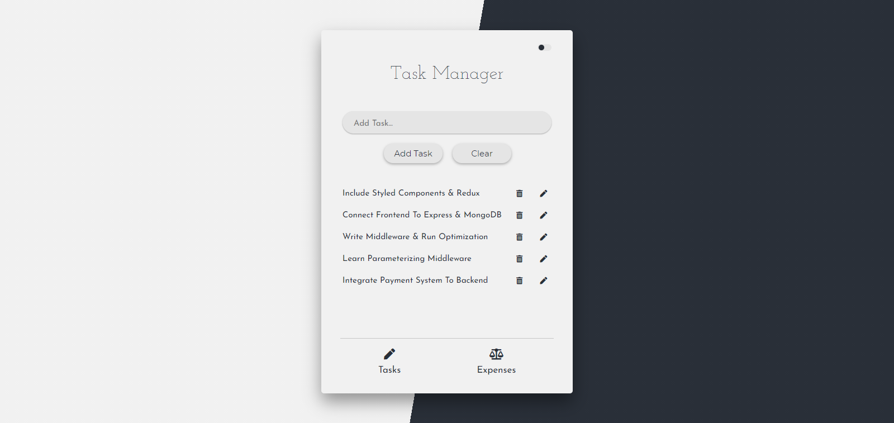

# React Task Manager

<!-- ## [Demo](https://react-task-manager-application.herokuapp.com/) -->
<a href="https://react-task-manager-application.herokuapp.com/" target="_blank"><h2>Demo<a>
  

### This app contains two sections.

The first section contains a todo list that allows adding and editing existing todo list items.

The second section contains an expense tracker to add expenses and track your spending.

### Features

**React Context API and Hooks** for state management.

**JavaScript  arithmetic calculations and string manipulation methods.**

**React Router** & **Local Storage**
